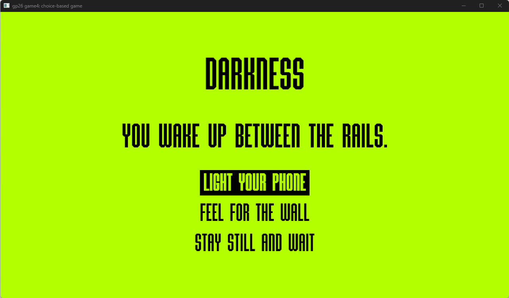

# Subway Crash

Author: Tao Jin

Design: This is a choice-based text game. You find yourself in a subway crash, and you need to discover the reason behind the crash and find a way back to the ground.

Text Drawing: The source of the text to be drawn is hard-coded in Story.cpp. The text is rendered at runtime by: 1. loading the font file; 2. shape strings to glyph index + advance / offset with harfbuzz; 3. rasterize glyph index to 8 bit bitmap + bearing with freetype; 4. position each pixel quad; 5. submit quad vertices and texture to GL;

Choices: The game stores choices by node-based graphs in Story.cpp.

Screen Shot:

How To Play:

Use ↑ and ↓ arrow keys for choice selection, and use Enter for proceeding with the current choice.

Sources: https://www.behance.net/gallery/227048755/MARATYPE-custom-display-font

This game was built with [NEST](NEST.md).

